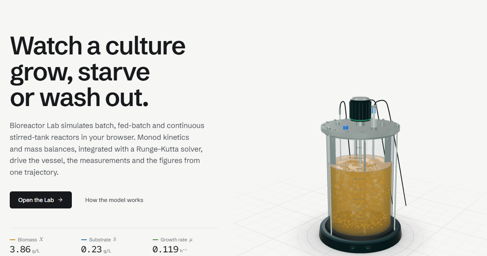

<div align="center">

# Bioreactor Lab

**Watch a culture grow, starve, or wash out.**

An interactive teaching laboratory for bioprocess kinetics. Run batch, fed-batch and continuous (CSTR) bioreactors in your browser, and watch a 3D vessel, live metrics and charts respond to the same simulated state.

[](https://cephalonsirin.github.io/bioreactor-sim/)
[](https://github.com/CephalonSirin/bioreactor-sim/actions/workflows/deploy.yml)

<br />

<a href="https://cephalonsirin.github.io/bioreactor-sim/">
  
</a>

</div>

<br />

> **Educational, simplified and deterministic.** Idealised mass balances with one limiting substrate. It is a teaching tool, not an industrial process simulator. The Methodology page lists every equation, unit and assumption.

## Highlights

| | |
|---|---|
| **3D reactor** | A WebGL stirred tank: turbidity and amber cells track biomass, teal glow tracks substrate, coral rings track product, gas follows aeration plus growth activity, and feed and harvest lines run at the simulated flow. Orbit, zoom, and toggle visual layers. Falls back to an SVG drawing without WebGL 2. |
| **Three reactor modes** | Batch, fed-batch and CSTR, with parameter validation and advisories (for example when `D` exceeds the critical dilution rate). |
| **Live playback** | Run, pause, resume, reset, 1–20× speed and a scrubbable timeline. Reactor, 8 metric cards and charts always show the same trajectory point. |
| **8 guided experiments** | Healthy Batch Growth, Substrate Limited, Fast Growth, High Feed Fed-Batch, Controlled Fed-Batch, Low Feed, Stable CSTR and CSTR Washout. Overlay any two to compare. |
| **Learn and Methodology** | Ten concept-first topics with interactive explainers (Monod curve, Luedeking–Piret, yield, dilution rate, washout), plus every equation with variables, units and assumptions. |
| **Classroom mode** | Press `P` for a larger reactor, numbers and charts. `Space` plays or pauses, `R` re-runs, `Esc` exits. |
| **Export** | Trajectory CSV, full experiment JSON, reactor image and per-chart PNGs. |

## The model

| | |
|---|---|
| Growth | Monod, `μ = μmax · S / (Ks + S)` |
| Product | Luedeking–Piret, `qp = α·μ + β` |
| Substrate uptake | `qS = μ / Yx/s + qp / Yp/s + ms` |
| Balances | Per-mode mass balances for biomass `X`, substrate `S`, product `P` and volume `V` |
| Solver | 4th-order Runge–Kutta, integrated once per run |
| CSTR check | Critical dilution rate `D_crit = μ(Sf) − kd`; the analytical steady state validates the solver |

Source of truth: [`src/simulation/`](src/simulation).

## Getting started

Requires Node 20.19+ (or 22.12+).

```bash
npm install
npm run dev        # http://localhost:5173
```

| Script | What it does |
|---|---|
| `npm run dev` | Start the dev server |
| `npm run lint` | ESLint |
| `npm run build` | Type-check and build to `dist/` |
| `npm run preview` | Serve the production build |

## How it is built

**Stack:** React 18, TypeScript, Vite, Tailwind CSS, three.js via React Three Fiber, Recharts.

```
src/simulation/   pure model: kinetics, mass balances, RK4, metrics, presets, validation, export
src/hooks/        simulation engine (reducer + playback), hash router
src/components/   viz3d (WebGL reactor + HUD), viz (SVG fallback), lab, learn, home, layout, ui
src/pages/        Home, Learn, Experiments, Methodology (the Lab lives in components/lab)
src/content/      equation text and topic lists shown across the site
```

- **One trajectory, everywhere.** A run is integrated once; playback only reveals a slice of it, so charts, metric cards and the reactor never disagree.
- **The scene never re-renders per tick.** Simulation updates write to a mutable bus that the WebGL scene damps toward each frame, so playback does not touch the React scene graph.
- **Cheap to run.** Particles and bubbles are GPU-instanced with the motion in the vertex shader, and only visible particles are drawn. Rendering runs at full rate only while something moves, and pixel ratio adapts to measured smoothness. Charts refresh at 10 Hz during playback and pause off-screen.
- **Graceful everywhere.** Low-power devices get a lighter scene, `prefers-reduced-motion` is respected, and the SVG reactor takes over if WebGL 2 is unavailable.

## Deployment

A fully static site (hash routing, relative asset paths). Every push to `main` is linted, built and published to GitHub Pages by [`deploy.yml`](.github/workflows/deploy.yml). Any static host also works: build with `npm run build` and serve `dist/`.

`VITE_SITE_URL` in [`.env`](.env) sets the absolute URL of the social-preview image; change it if you host elsewhere.

## References

Monod (1949) *Annu. Rev. Microbiol.* 3:371–394 · Luedeking & Piret (1959) *J. Biochem. Microbiol. Technol. Eng.* 1:393–412 · Shuler & Kargı, *Bioprocess Engineering: Basic Concepts* · Doran, *Bioprocess Engineering Principles*
